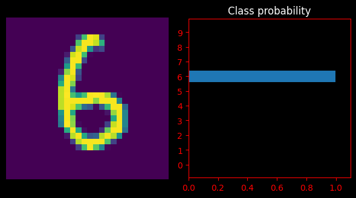
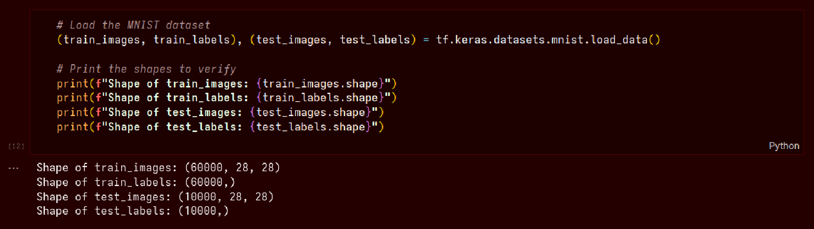

<h1 align=center>Inkwell </h1> 
<h3 align=center>Handwritten digit recognition engine.</h3>

 

This project implements a neural network model to recognize handwritten digits from the MNIST dataset. The MNIST dataset consists of 70,000 grayscale images of handwritten digits (0–9), each of size 28x28 pixels, split into 60,000 training images and 10,000 test images.

#### The model is trained using a feedforward neural network architecture with the following key components:

- Input Layer: Accepts 784 features (flattened 28x28 image)
- Hidden Layers: 2 densly connected layers with 128 and 64 neurons respectively with ReLU activation
- Output Layer: 10 neurons representing digit classes (0–9), using softmax activation

 

### Training Details
- Loss Function: Categorical Cross-Entropy
- Optimizer: Adam
- Learning Algorithm: Trained using backpropagation
- Batch Size: 1000 
- Epochs: 5

 

### Results

The model achieves high accuracy on the test set and effectively generalizes to unseen handwritten digits. Evaluation metrics such as accuracy and loss can be visualized through training plots

    
    

    
    

    
    

 

### Dataset
- Source: MNIST
- 60,000 training images
- 10,000 test images
- Digit classes: 0 to 9

 

### Dependencies
- Python
- NumPy
- TensorFlow
- Matplotlib

 

### Contribute

- Fork this repository.
- Create your own branch.
- Commit changes.
- Submit a pull request.

your code will be reviewed and request will be merged!

### Appreciation
Give this repo a star! Submit issues if you find bugs!